# Room Ranker

## Overview

Room Ranker is the one-stop collection of escape rooms sourced and ranked by the escape room community. Each room has a number of criteria by which it is ranked, and community members that play the rooms can leave a review and comment on what they liked/disliked about it.

Room Ranker is a fullstack web application that allows users to create, read, update, and delete content served from a database.

### Problem Space

Escape room ranking websites are nothing new, a quick search will result in many "top 10 escape rooms" sites. These sites, though useful for a quick search, often do not show the true breadth of escape rooms that exist. These sites are usually limited to the "top 5" or "top 10" rooms, when there are thousands of rooms across the world. Escape room franchises also have the same room in multiple locations, and oftentimes the experiences and quality of the rooms differs between locations due to various factors.

There is one website that attempts to be a central source for ranking escape rooms (https://escaperoomrank.com/), however it has a number of problems associated with it. It has not been updated since 2018, the information present is outdated and repetitive, and the all rooms tab is filled with bot answers.

### User Profile

People who will use Room Ranker include:
- Escape room owners looking to increase traffic and get the word out about their new rooms.
- Beginner players looking to find affordable rooms that are right for them.
- Escape room enthusiasts looking for a challenge and bragging rights.

### Features

List the functionality that your app will include. These can be written as user stories or descriptions with related details. Do not describe _how_ these features are implemented, only _what_ needs to be implemented.

- Database accessible via API that holds information about users and escape rooms
- Sort rooms based on:
> - Room Name
> - Room Theme
> - Overall Rating
> - Completion Rate
> - Difficulty
> - Favourite Rooms
- Filter rooms based on:
> - Room Theme
> - Success Rate
> - Group Size
> - Online
> - Offline
> - Price Range
- create account / login to view favourited rooms, rooms posted (for owner accounts), and reviews posted (for player accounts)
- Owner accounts can create, update, and delete room pages
- Player accounts can post comments and reviews to room pages
- Search for rooms near you

## Implementation

### Tech Stack

- axios
- react
- nodemon
- mysql
- express

### APIs
Google APIs
(https://mapsplatform.google.com/pricing/?_gl=1%2A13lzcg2%2A_ga%2AMjEyNTc1NjYzOS4xNzA2MDQxNzU0%2A_ga_NRWSTWS78N%2AMTcwNjA0MTc1NC4xLjEuMTcwNjA0MjI1Ni4wLjAuMA..#pricing-grid)
- Google Geolocation API
- Google Geocoding API
- Google Nearby Search API

### Sitemap
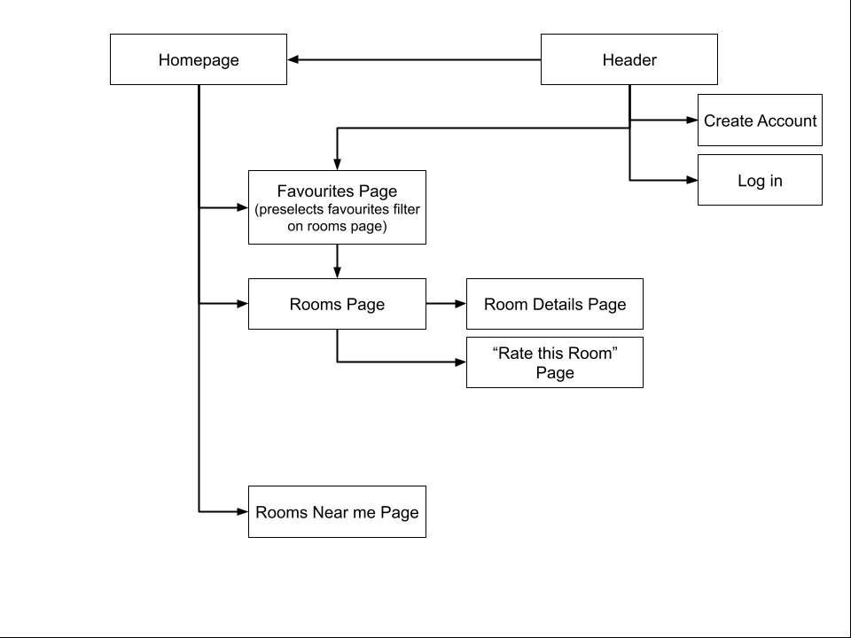

### Mockups

#### Homepage
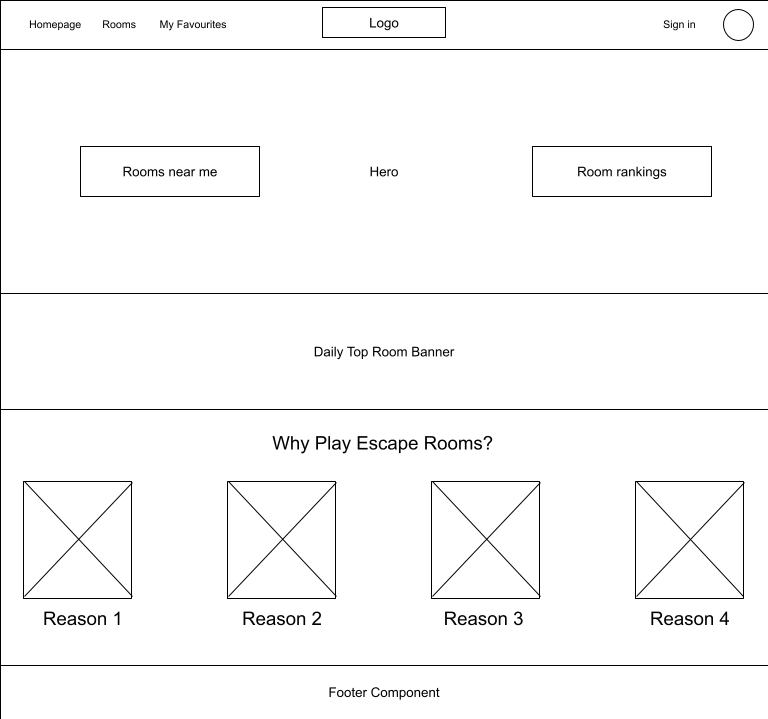
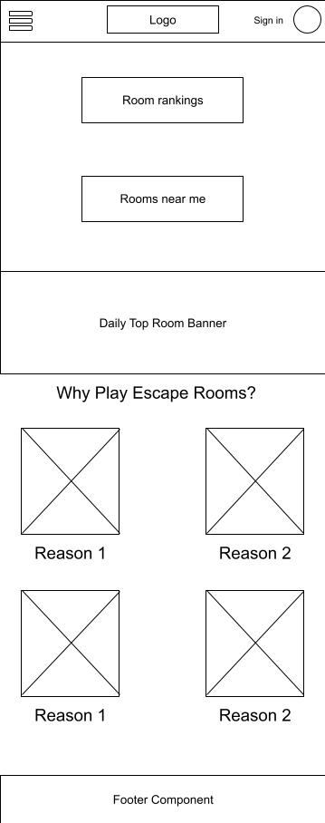

#### Rooms Page
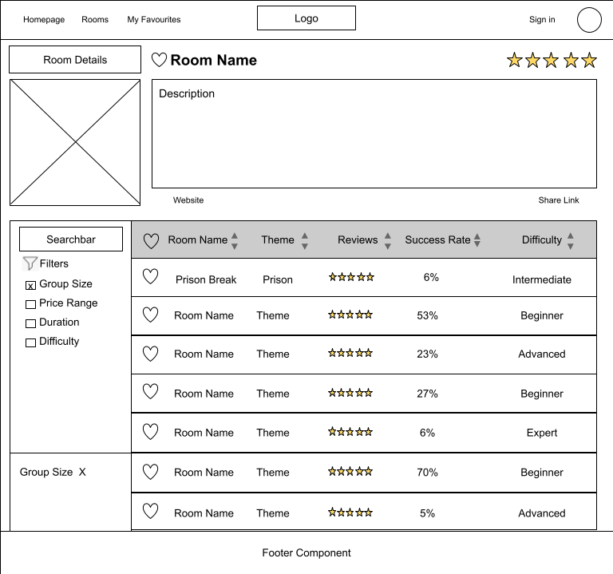
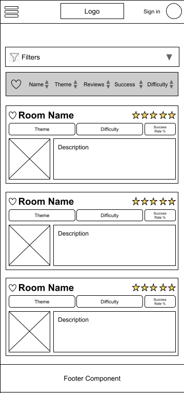

#### Room Details Page
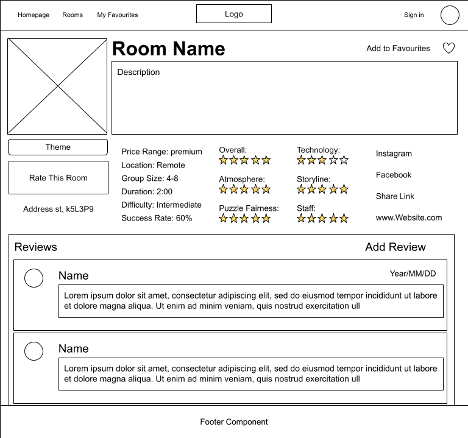
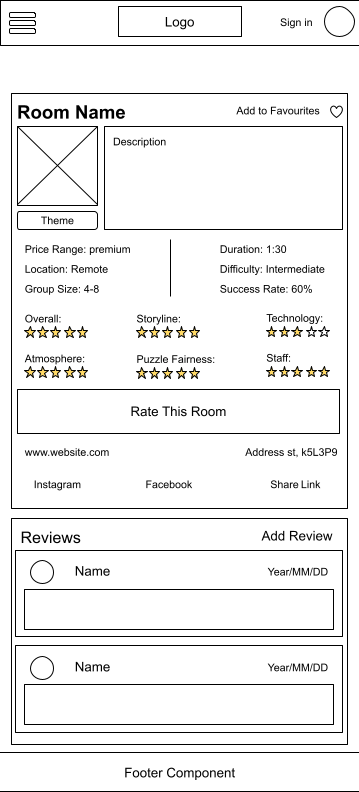

#### Login Page
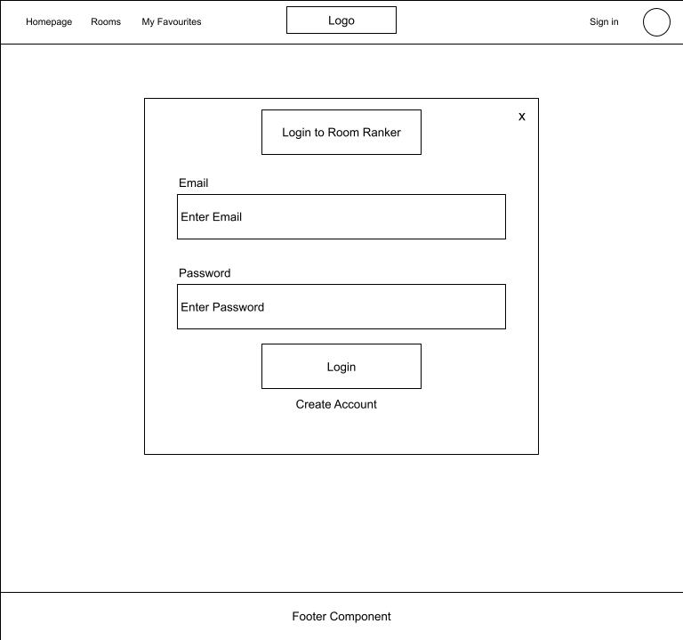
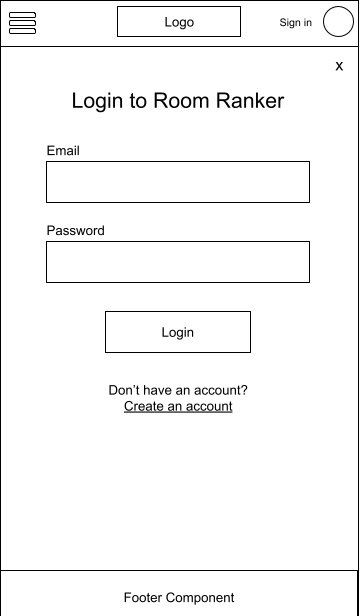

#### Create Account Page

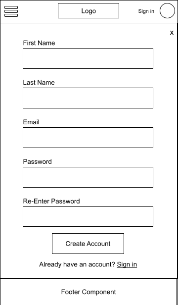

#### Rate this Room Page
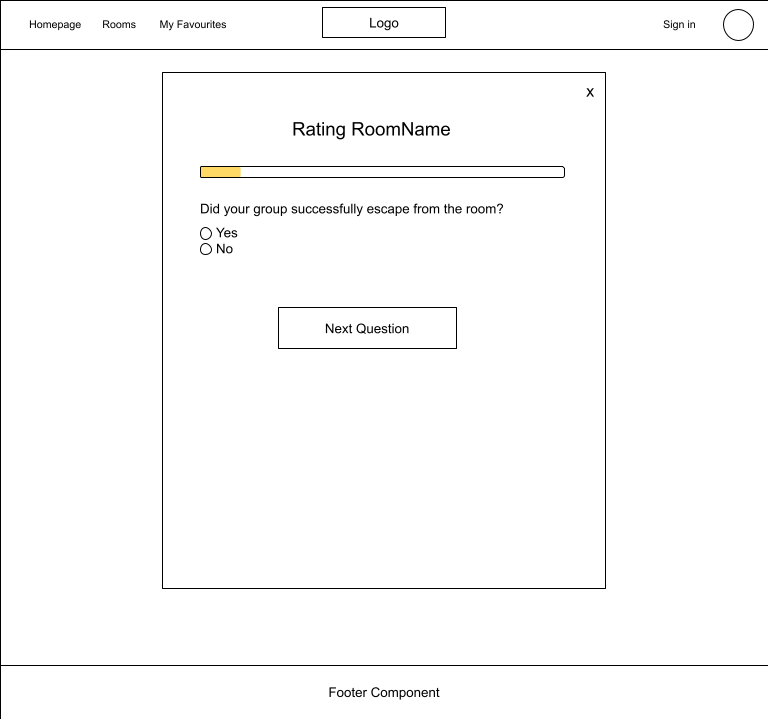
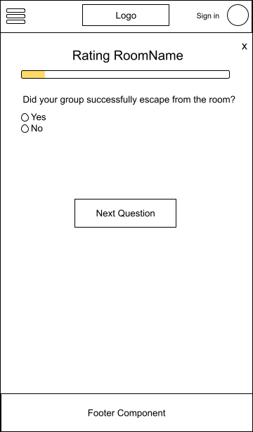

#### Rooms Near Me Page
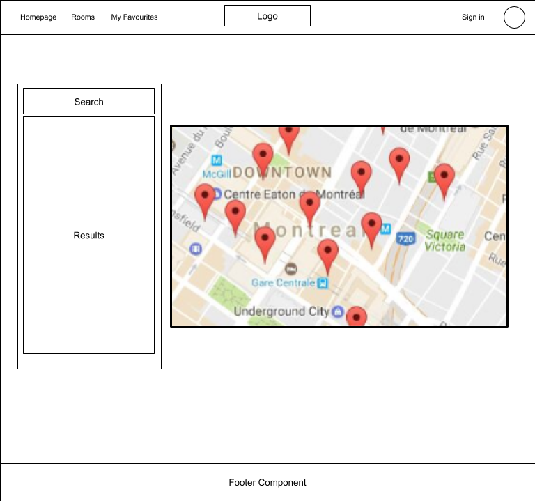
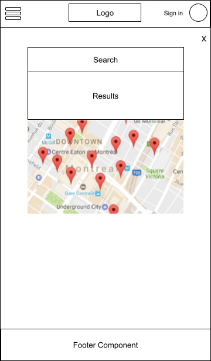

#### Add New Room
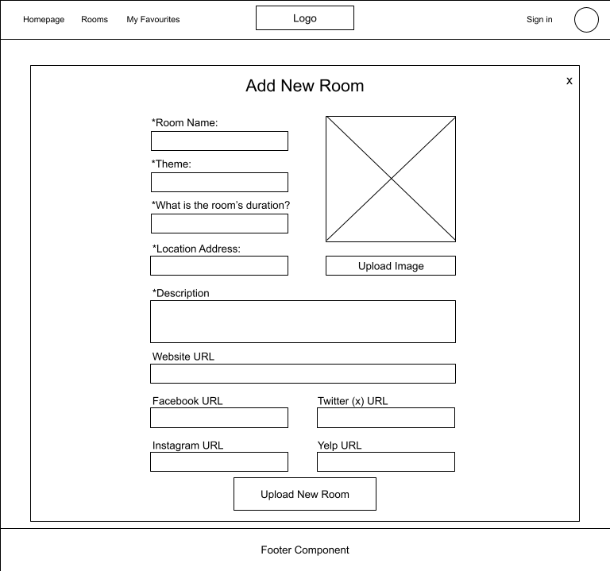
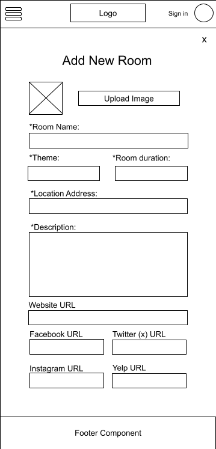

### Data

Describe your data and the relationships between them. You can show this visually using diagrams, or write it out. 

### Endpoints

List endpoints that your server will implement, including HTTP methods, parameters, and example responses.
- Homepage: "/"
- Rooms Page: "/rooms"
- Room Details Page: "/rooms:id"
- Rate this Room Page: "/rooms:id/rate"
- Login Page: "/login"
- Create Account Page: "/create-account"
- Rooms Near Me: "/rooms-nearby"

### Auth TBD

Does your project include any login or user profile functionality? If so, describe how authentication/authorization will be implemented.

## Roadmap

*Use placeholder data while determinig database structure. Once database is setup, replace placeholder info with database info.*

1. Create Front End HTML and SCSS Structure for:
    - Homepage
    - Room page
    - Room details page
    - Login Page
    - Create Accounts page
    - Rooms near me page
    - 'add room' page for owner accounts
    - rate this room page
2. add browser routes and links to pages
3. add filter functionality to rooms page
4. add room rating form functionality 
5. add sort functionality to rooms list section on rooms page
6. add favourites functionality to 'add to favourites' button
7. add review/commenting functionality to reviews section in room details page
8. add 'add room' functionality for owner accounts
9. Hookup Google Api to send to google when clicking on address
10. Hookup Google Api to "rooms near me" page

## Nice-to-haves

- Create blog for the web site for better SEO and community engagement
- ReCaptcha validation for creating new account (https://developers.google.com/recaptcha)
- User Authentication using firebase (https://firebase.google.com/docs/firestore)
- Room owners can post updates about their room
- Users can subscribe to an owner's page to get updates about their rooms
- Users can save rooms to their 'favourites' for a collection of their favourite experiences.
- owner account features
- Onboarding for first-time users to show how to find rooms and rank them.
